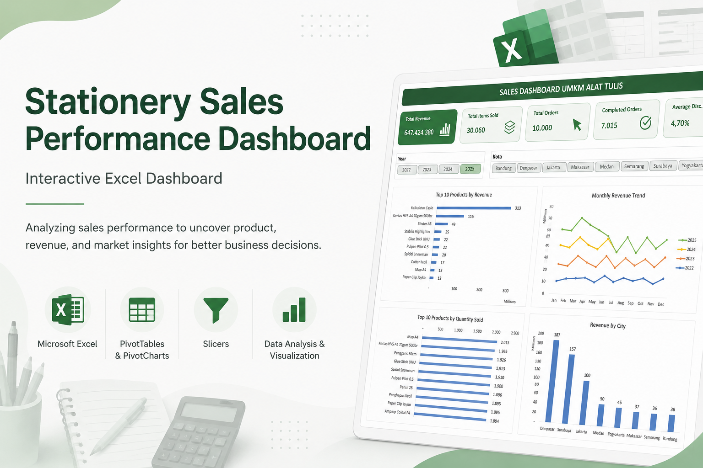
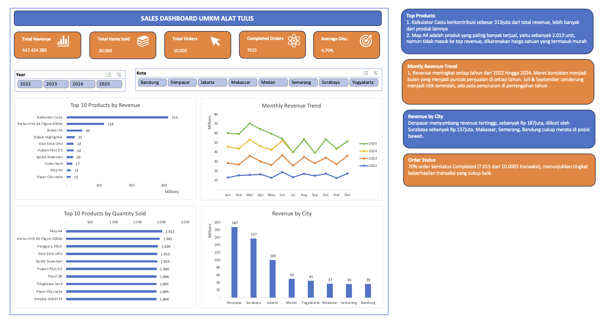

# Stationery Sales Performance Dashboard

An interactive Microsoft Excel dashboard developed to analyze stationery sales performance and transform transactional data into actionable business insights.

## 📌 Project Overview

This project analyzes sales transaction data from a stationery business to provide a clear overview of business performance.

The dashboard was designed to help business owners monitor key sales metrics, identify top-performing products, analyze revenue trends, compare performance across cities, and support data-driven decision-making.

## 🎯 Objectives

- Monitor overall sales performance
- Identify top-performing products by revenue and quantity sold
- Analyze monthly revenue trends
- Compare revenue performance across cities
- Monitor order completion performance
- Enable interactive analysis using year and city filters

## 📊 Key Metrics

The dashboard tracks:

- **Total Revenue:** IDR 647,424,380
- **Total Items Sold:** 30,060
- **Total Orders:** 10,005
- **Completed Orders:** 7,015
- **Average Discount:** 4.70%

## 📈 Dashboard Preview

The dashboard combines KPI cards, PivotCharts, and interactive slicers to provide multiple views of sales performance.

### Dashboard Components

- Top 10 Products by Revenue
- Top 10 Products by Quantity Sold
- Monthly Revenue Trend
- Revenue by City
- Year Slicer
- City Slicer
- Key Business Insights

## 💡 Key Insights

### Calculator Casio generates the highest revenue

Calculator Casio contributed approximately **IDR 313 million**, making it the highest revenue-generating product in the dataset.

### Map A4 leads by quantity sold

Map A4 recorded approximately **2,013 units sold**, making it the highest-selling product based on quantity.

### Revenue generally increases across years

Revenue shows an overall upward pattern from **2022 to 2024**, although monthly fluctuations remain visible throughout each year.

### Denpasar is the strongest market

Denpasar generated approximately **IDR 187 million in revenue**, followed by Surabaya at approximately **IDR 157 million**.

### Most orders were successfully completed

Approximately **70% of total orders were completed**, representing **7,015 out of 10,005 transactions**.

## 🎯 Business Recommendations

Based on the analysis:

- Maintain availability and sales performance of high-demand products such as Calculator Casio and Map A4.
- Investigate the factors contributing to strong sales periods to identify opportunities for seasonal campaigns or inventory planning.
- Maintain performance in strong markets such as Denpasar and Surabaya while exploring opportunities to improve sales in lower-performing cities.
- Monitor order completion rates and investigate factors contributing to incomplete transactions.
- Use product revenue and quantity sold together when evaluating product performance, as high sales volume does not always correspond to the highest revenue contribution.

## 🛠 Tools & Techniques

- Microsoft Excel
- PivotTables
- PivotCharts
- Slicers
- Data Aggregation
- Data Visualization
- Sales Performance Analysis
- Business Insight Generation

## 📁 Repository Contents

- `Stationery-Sales-Performance-Dashboard.xlsx` — interactive Excel dashboard and analysis
- `dashboard-preview.png` — dashboard preview
- `stationery-sales-dashboard-cover.png` — project cover
- `README.md` — project documentation

## 🚀 Skills Demonstrated

This project demonstrates my ability to transform transactional data into an interactive business dashboard, analyze sales performance from multiple perspectives, and translate findings into actionable business recommendations.
